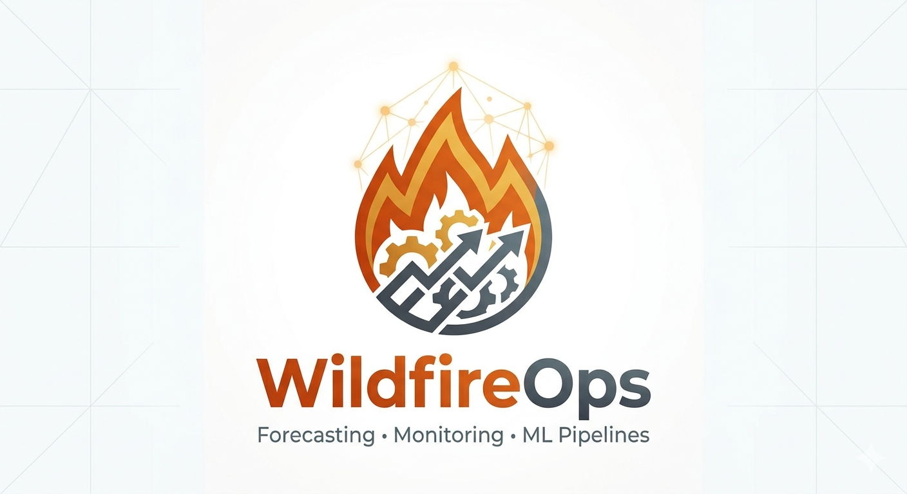

# WildfireOps

## Predicting wildfire risk through a reproducible, testable, and production-oriented ML pipeline.

## Project Overview

Wildfires are one of the most serious environmental and public-safety threats, affecting ecosystems, infrastructure, and human life. **WildfireOps** is an end-to-end MLOps project designed to forecast wildfire risk using historical satellite fire detections and weather data.

Rather than treating machine learning as a notebook-only experiment, this repository is being developed as a production-oriented system: from raw data ingestion and validation, to dataset construction, weather enrichment, feature engineering, model training, testing, and governance through CI/CD and security checks.

The current implementation focuses on building a reliable baseline system using:

- **NASA FIRMS** wildfire detections for positive fire-event data
- **Open-Meteo Historical API** for weather enrichment
- synthetic **negative sampling** for supervised binary classification
- a reproducible Python pipeline for baseline model training

---

## Current Project Status

The project currently includes a working Phase 1 baseline pipeline with:

- ingestion and merge of wildfire event data from **NASA FIRMS**
- validation of raw fire-event records
- positive fire-event dataset construction
- negative sample generation for binary classification
- labeled training dataset creation
- weather enrichment through **Open-Meteo**
- disk-based caching for weather API lookups
- feature engineering
- baseline model training with **Logistic Regression**
- automated tests for core pipeline components
- repository governance with **GitHub Actions**, **CodeQL**, and dependency review

This means the repository is no longer only a scaffold: it already contains a functioning wildfire risk training workflow.

---

## Implemented Pipeline

### 1. Data Ingestion
The pipeline ingests historical wildfire detections for Italy from **NASA FIRMS** and combines multi-file yearly datasets into a unified fire-events table.

### 2. Data Validation
Incoming wildfire records are validated for:

- required columns
- missing values
- duplicate rows
- invalid geographic coordinates
- invalid numeric ranges

### 3. Dataset Construction
The project builds a binary classification dataset by:

- treating FIRMS detections as **positive wildfire events**
- generating **negative non-fire samples**
- merging both into a labeled training dataset

### 4. Weather Enrichment
Each training row is enriched with historical weather variables from **Open-Meteo**, including:

- temperature
- relative humidity
- precipitation
- wind speed

A local disk cache is used to avoid repeated API calls for the same date/location combinations.

### 5. Feature Engineering
The enriched dataset is transformed into model-ready features, including:

- latitude / longitude
- weather variables
- temporal features such as month and day-of-year

### 6. Model Training
The current baseline model is:

- **Logistic Regression**

Evaluation currently includes:

- accuracy
- precision
- recall
- F1 score
- ROC-AUC

---

## Current Tech Stack

- **Language:** Python 3.11
- **Data Processing:** pandas, numpy
- **ML Models:** scikit-learn, XGBoost
- **Weather Data:** Open-Meteo Historical API
- **Wildfire Data:** NASA FIRMS
- **Caching / Artifacts:** local file system, joblib, JSON
- **Testing:** pytest
- **Code Quality:** black, ruff
- **CI/CD:** GitHub Actions
- **Security:** CodeQL, dependency review
- **Planned MLOps Extensions:** DVC, MLflow, FastAPI, Evidently

---

## Repository Workflow

The project follows a structured Git workflow:

- `main` → protected production-ready branch
- `development` → integration branch
- `feature/<branch-name>` → feature-specific implementation branches

All changes are developed in feature branches, merged into `development`, and then promoted to `main` through pull requests with automated checks.

### Branch Protection Strategy

#### `development`
- pull request required before merge
- CI must pass before merge
- no approval required

#### `main`
- pull request required before merge
- CI, CodeQL, and dependency review must pass
- branch must be up to date before merge
- no approval required

This creates a two-stage delivery flow:

`feature/*` → `development` → `main`

---

## Roadmap

### Phase 1 — Core ML Pipeline
Implemented / in progress:

- wildfire ingestion from NASA FIRMS
- validation layer
- positive/negative dataset creation
- weather enrichment
- feature engineering
- baseline model training
- automated tests

### Phase 2 — Model Benchmarking & Experiment Tracking
Planned next:

- compare baseline models:
  - Logistic Regression
  - Random Forest
  - XGBoost
- add experiment tracking with **MLflow**
- compare model performance and select the final baseline model

### Phase 3 — Data Versioning & Reproducibility
Planned:

- integrate **DVC**
- define pipeline stages in `dvc.yaml`
- version training data and model artifacts

### Phase 4 — Serving & Monitoring
Planned:

- expose the trained model through **FastAPI**
- containerize with **Docker**
- monitor data and prediction drift with **Evidently**
- evolve toward a production-grade wildfire early warning system

---

## Why This Project Matters

This project is designed not only to predict wildfire risk, but also to demonstrate how environmental ML systems should be built:

- reproducibly
- transparently
- testably
- with operational discipline

The long-term goal is to support emergency planning, environmental monitoring, and resource allocation with a workflow that is auditable rather than opaque.

---

## Next Milestones

The next development priorities are:

1. scale weather enrichment beyond the current sample subset
2. improve the quality of negative sampling
3. benchmark additional models such as Random Forest and XGBoost
4. integrate MLflow for experiment tracking
5. add DVC for data and pipeline reproducibility
6. build a FastAPI inference service

---

## Disclaimer

This repository is an engineering and MLOps project focused on wildfire risk modeling and workflow design. It is not intended to replace official emergency forecasting or operational incident response systems.